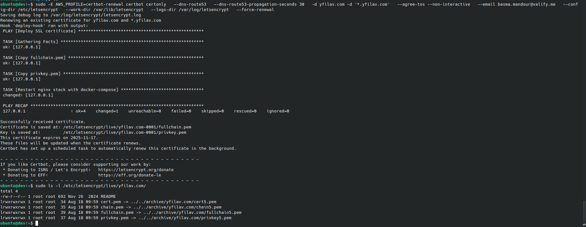

# SSL Certificate Automation With Certbot and Route53 plugin Documentation

## 1. Overview

This documentation covers the complete SSL certificate automation setup for the domain `yfilav` using:
- **Certbot** with DNS-01 challenge via Route53 plugin
- **Ansible** for automated deployment
- **Certbot.Timer renewal** with deployment hooks for Daily certificate checks at 7:00 AM

## 2. Architecture

```
┌─────────────────┐     ┌─────────────────┐
│   Dev Machine   │───▶│   AWS Route53   │
│ • Certbot       │     │ • DNS Records   │
│ • Ansible       │     │ • TXT Records   │
│ • Certbot.Timer │     │ • Validation    │
└─────────────────┘     └─────────────────┘
```

## 3. Prerequisites

### Required Software
- **Certbot**: `certbot >= 1.0`
- **DNS Route53 Plugin**: `certbot-dns-route53`
- **Ansible**: `ansible >= 2.9`
- **AWS CLI**: `aws-cli >= 2.0`
- **Python**: `python >= 3.6`

### AWS Configuration
- AWS credentials configured (`~/.aws/credentials`)
- Route53 hosted zone for `yfilav` domain

## 4. Installation & Setup

###  Install Required Packages

```bash
# Install Certbot and Route53 plugin
sudo apt update
sudo apt install certbot python3-certbot-dns-route53

# Install Ansible
sudo apt install ansible
```
###  AWS Credentials Setup

Create AWS credentials file:

```bash
# ~/.aws/credentials
[certbot-renewal]
aws_access_key_id = ACCESS_KEY
aws_secret_access_key = SECRET_KEY
```
### 5. Certbot Renewal Configuration

Location: `/etc/letsencrypt/renewal/yfilav.com.conf`
```ini
archive_dir = /etc/letsencrypt/archive/yfilav.com
cert = /etc/letsencrypt/live/yfilav.com/cert.pem
privkey = /etc/letsencrypt/live/yfilav.com/privkey.pem
chain = /etc/letsencrypt/live/yfilav.com/chain.pem
fullchain = /etc/letsencrypt/live/yfilav.com/fullchain.pem

[renewalparams]
account = ACCOUNT_ID
authenticator = dns-route53
dns_route53_propagation_seconds = 60
server = https://acme-v02.api.letsencrypt.org/directory
```
## 6. Ansible Deployment Configuration

###  Hosts File
Create `/etc/ansible/hosts`:
```
[dev]
IP ansible_connection=local ansible_python_interpreter=/usr/bin/python3
```
###  Ansible Playbook
Create `/etc/ansible/deploy-ssl.yml`:
```yaml
- name: Deploy SSL certificate
  hosts: dev
  become: yes
  tasks:
    - name: Copy fullchain.pem
      copy:
        src: /etc/letsencrypt/live/yfilav.com/fullchain.pem
        dest: /home/ubuntu/ssl/www_yfilav_com.crt
        owner: ubuntu
        group: ubuntu
        mode: 0644
        remote_src: true

    - name: Copy privkey.pem
      copy:
        src: /etc/letsencrypt/live/yfilav.com/privkey.pem
        dest: /home/ubuntu/ssl/www_yfilav_com.key
        owner: ubuntu
        group: ubuntu
        mode: 0600
        remote_src: true

    - name: Restart nginx stack with docker-compose
      become: true
      shell: |
        docker-compose -f /home/ubuntu/deploy/docker-compose.nginx.yml stop portal_nginx
        docker-compose -f /home/ubuntu/deploy/docker-compose.nginx.yml rm -f portal_nginx
        docker-compose -f /home/ubuntu/deploy/docker-compose.nginx.yml up -d portal_nginx
      args:
        chdir: /home/ubuntu/deploy
```
## Restarting Nginx  with Docker-Compose  

- Nginx is running inside a Docker container not as a standalone system service 
- `docker-compose` to restart the container and apply the updated SSL certificates.  
This ensures that the new certificates are loaded correctly.  

## Configuration Files
Create `/etc/letsencrypt/renewal-hooks/deploy/deploy-cert.sh`
```bash
ansible-playbook /etc/ansible/deploy-ssl.yml
```
Make file executable
```bash
sudo chmod +x /etc/letsencrypt/renewal-hoo/home/bassma/Documents/GitHub/SSL_Automation_Certbot/assets/
/etc/letsencrypt/
├── live/yfilav.com/                 # Current certificates
├── archive/yfilav.com/              # All certificate versions
├── renewal/yfilav.com.conf          # Renewal configuration
└── renewal-hooks/
    └── deploy/
        └── deploy-ssl.sh        # Deployment hook script
```
## 8. Certbot Timer Configuration

###  Certificate Renewal Cron

```bash
sudo systemctl edit certbot.timer
```
```yaml
# /lib/systemd/system/certbot.timer
[Unit]
Description=Run certbot once daily at 07:00

[Timer]
OnCalendar=
OnCalendar=*-*-* 07:00:00
Persistent=true

[Install]
WantedBy=timers.target
```
### Apply Changes
```bash
sudo systemctl daemon-reload
sudo systemctl restart certbot.timer
systemctl list-timers | grep certbot
```


## 9. Certificate Renewal
```bash
ansible-playbook /etc/ansible/deploy-ssl.yml
```


### Force certificate renewal
```bash
sudo -E AWS_PROFILE=certbot-renewal certbot certonly   --dns-route53   --dns-route53-propagation-seconds 30   -d yfilav.com -d '*.yfilav.com'   --agree-tos --non-interactive   --email basma.mandour@valify.me   --config-dir /etc/letsencrypt   --work-dir /var/lib/letsencrypt   --logs-dir /var/log/letsencrypt   --force-renewal
sudo ls -l /etc/letsencrypt/live/yfilav.com/
```

### Verifying the Certificate Renewal
```bash
sudo certbot certificates | grep -A 5 "yfilav"
echo | openssl s_client -connect yfilav 2>/dev/null | openssl x509 -noout -dates
curl -vI https://yfilav.com 2>&1 | grep "expire date"
```


## 10. Testing
### Test Ansible deployment
```bash
ansible-playbook /etc/ansible/deploy-ssl.yml --check
```

